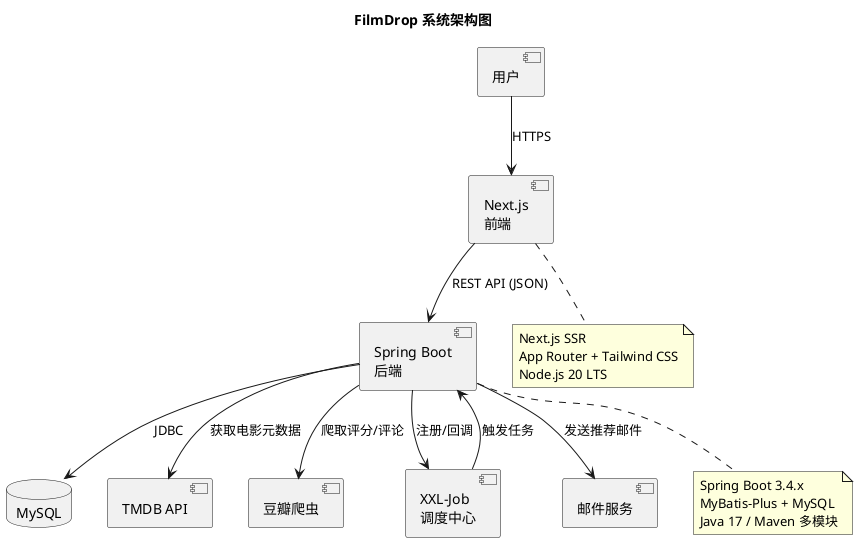
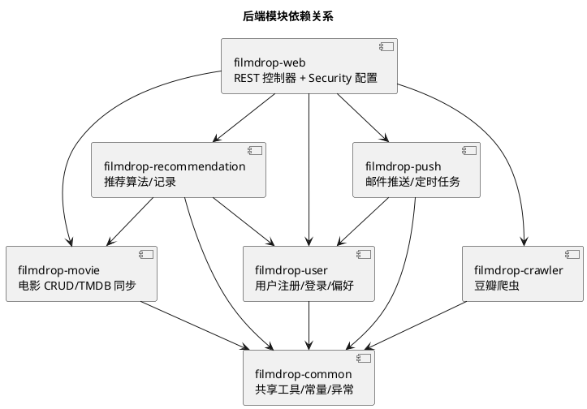
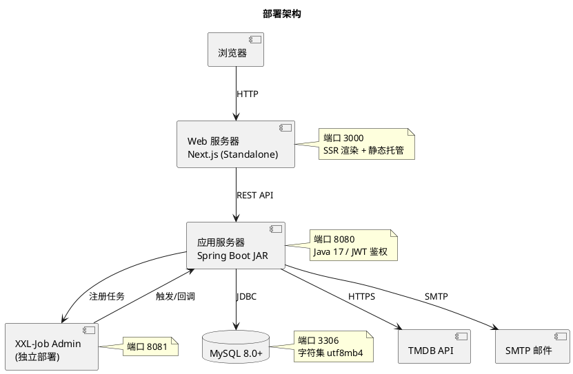

# FilmDrop 架构图

> 使用 PlantUML 绘制，支持 VS Code PlantUML 插件预览。

---

## 1. 系统架构图

```plantuml
@startuml
title FilmDrop 系统架构图

component "用户" as user
component "Next.js\n前端" as frontend
component "Spring Boot\n后端" as backend
database "MySQL" as db
component "TMDB API" as tmdb
component "豆瓣爬虫" as douban
component "XXL-Job\n调度中心" as xxl
component "邮件服务" as mail

user --> frontend : HTTPS

frontend --> backend : REST API (JSON)

backend --> db : JDBC

backend --> tmdb : 获取电影元数据
backend --> douban : 爬取评分/评论

backend --> xxl : 注册/回调
xxl --> backend : 触发任务

backend --> mail : 发送推荐邮件

note bottom of frontend : Next.js SSR\nApp Router + Tailwind CSS\nNode.js 20 LTS

note bottom of backend : Spring Boot 3.4.x\nMyBatis-Plus + MySQL\nJava 17 / Maven 多模块
@enduml
```

## 2. 后端模块结构

```plantuml
@startuml
title 后端模块依赖关系

component "filmdrop-web\nREST 控制器 + Security 配置" as web

component "filmdrop-user\n用户注册/登录/偏好" as user
component "filmdrop-movie\n电影 CRUD/TMDB 同步" as movie
component "filmdrop-crawler\n豆瓣爬虫" as crawler
component "filmdrop-recommendation\n推荐算法/记录" as recommend
component "filmdrop-push\n邮件推送/定时任务" as push
component "filmdrop-common\n共享工具/常量/异常" as common

web --> user
web --> movie
web --> crawler
web --> recommend
web --> push

recommend --> movie
recommend --> user

push --> user

user --> common
movie --> common
crawler --> common
recommend --> common
push --> common
@enduml
```

## 3. 部署架构

```plantuml
@startuml
title 部署架构

component "浏览器" as browser

component "Web 服务器\nNext.js (Standalone)" as nextjs
note right of nextjs : 端口 3000\nSSR 渲染 + 静态托管

component "应用服务器\nSpring Boot JAR" as springboot
note right of springboot : 端口 8080\nJava 17 / JWT 鉴权

component "XXL-Job Admin\n(独立部署)" as xxl_admin
note right of xxl_admin : 端口 8081

database "MySQL 8.0+" as mysql
note right of mysql : 端口 3306\n字符集 utf8mb4

component "TMDB API" as tmdb
component "SMTP 邮件" as smtp

browser --> nextjs : HTTP
nextjs --> springboot : REST API

springboot --> mysql : JDBC
springboot --> tmdb : HTTPS
springboot --> smtp : SMTP
springboot --> xxl_admin : 注册任务
xxl_admin --> springboot : 触发/回调
@enduml
```

---

> 图表使用纯 `component` / `database` 元素，无嵌套、无自定义主题，兼容主流 PlantUML 渲染器。
